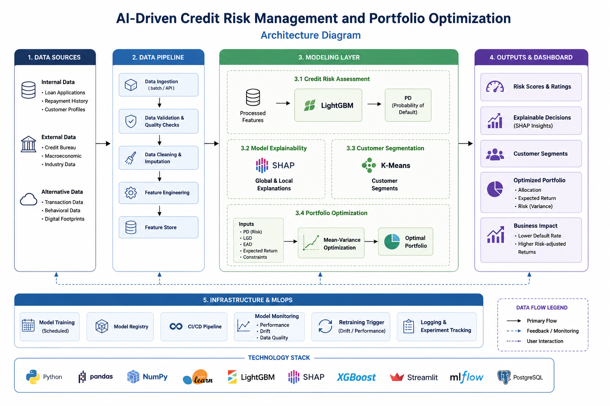
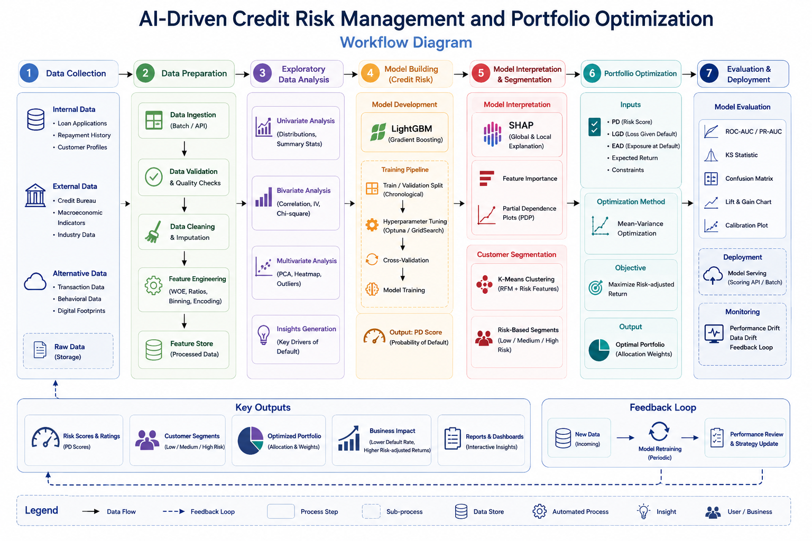
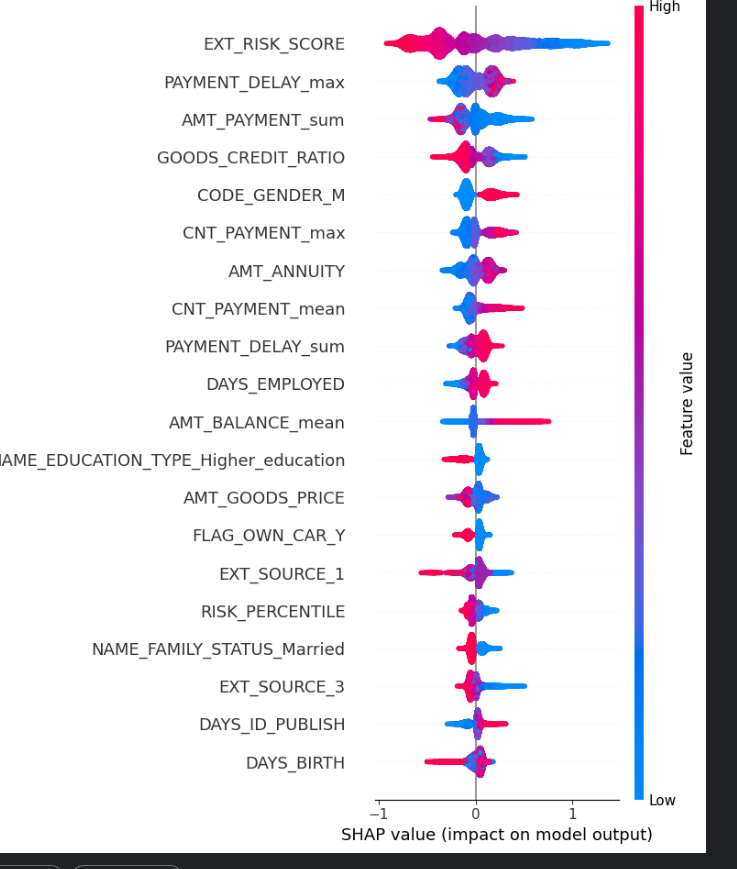
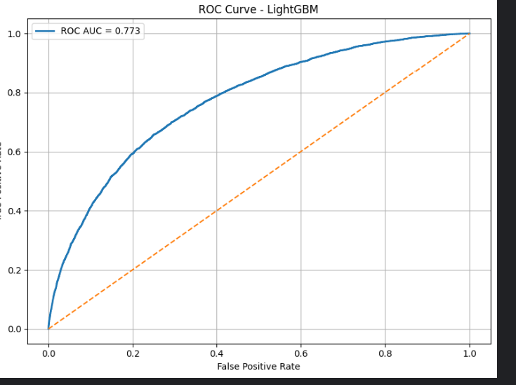
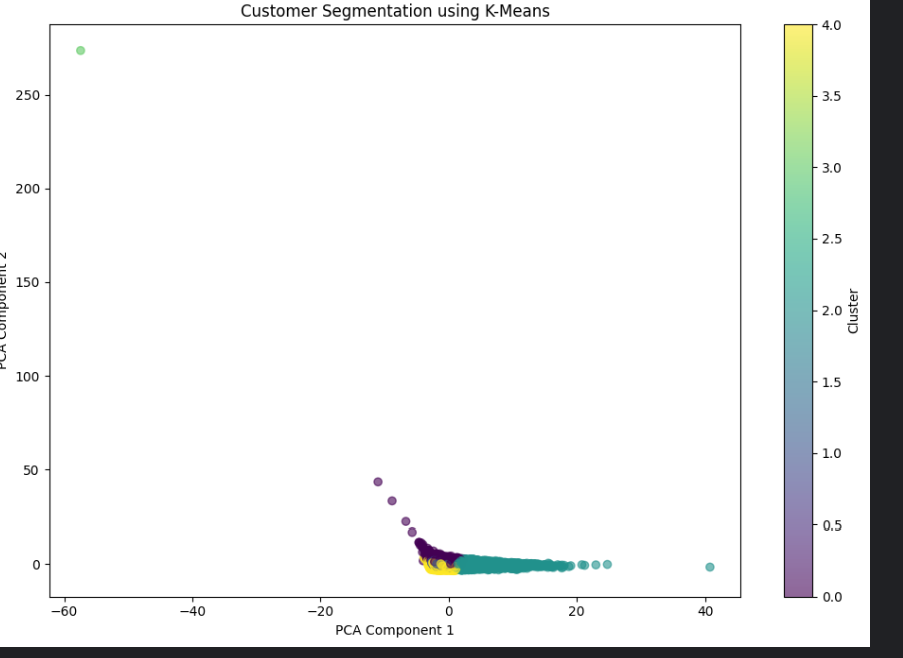
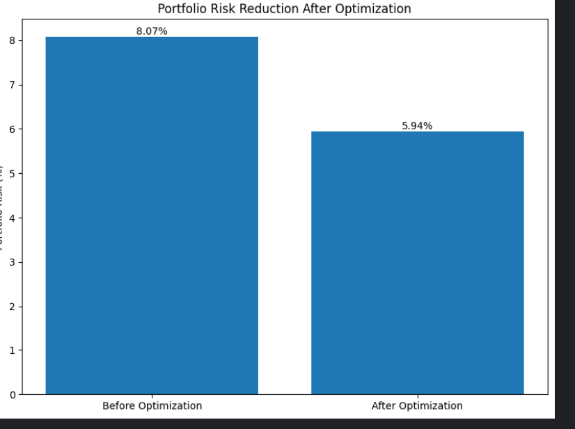

# AI-Driven Credit Risk Management and Portfolio Optimization

An end-to-end machine learning framework for credit risk assessment, explainable lending decisions, customer segmentation, and portfolio optimization using LightGBM and SHAP.

---

## Project Overview

Credit risk assessment is one of the most critical challenges faced by financial institutions. Traditional rule-based credit scoring systems often fail to capture complex relationships between borrower characteristics and repayment behaviour.

This project presents an AI-driven framework that combines machine learning, explainable AI, customer segmentation, and portfolio optimization techniques to support smarter lending decisions.

The framework transforms raw customer and credit data into actionable business insights, enabling lenders to:

- Predict loan default probability
- Identify high-risk customers
- Generate interpretable risk scores
- Segment customers into actionable groups
- Optimize lending portfolios
- Support risk-based pricing strategies

---

## Problem Statement

Financial institutions incur significant losses due to loan defaults and inefficient credit allocation strategies.

The objective of this project is to develop an intelligent and explainable machine learning system capable of:

1. Predicting default probability
2. Identifying financially stressed borrowers
3. Creating customer personas
4. Providing explainable predictions
5. Optimizing portfolio risk exposure
6. Supporting data-driven lending decisions

---

## System Architecture



---

## Project Workflow



---

## Dataset Information

Dataset: Home Credit Default Risk Dataset

Source:
https://www.kaggle.com/c/home-credit-default-risk

Dataset Statistics:

- Total Customers: ~307,510
- Engineered Features: ~183
- Multiple relational tables:
  - Application Data
  - Bureau Data
  - Previous Applications
  - Installment Payments
  - POS Cash Balance
  - Credit Card Balance

Target Variable:

- TARGET = 1 → Customer Default
- TARGET = 0 → Customer Repays Loan

---

## Methodology

### Data Collection
Integrated multiple relational datasets using customer identifiers.

### Data Preprocessing
- Missing value handling
- Outlier treatment
- Feature encoding
- Data normalization

### Feature Engineering
Created domain-specific features such as:

- Financial Stress Score
- Customer Value Score
- Risk Score
- Credit Dependency Ratio
- Debt Burden Indicators
- Income per Family Member
- Overdue Ratio

### Machine Learning Model
Model Used:

**LightGBM (Light Gradient Boosting Machine)**

Reasons for Selection:

- Handles large tabular datasets efficiently
- Supports missing values
- Fast training and inference
- Captures non-linear relationships
- Provides strong predictive performance

### Explainable AI
Implemented:

- SHAP (SHapley Additive Explanations)

Provides:

- Global feature importance
- Local prediction explanations
- Transparent lending decisions

### Customer Segmentation
Applied:

- K-Means Clustering

Generated customer groups such as:

- Prime High Value
- Mature Stable
- Credit Dependent
- Young High Risk

### Portfolio Optimization
Implemented:

- Risk-based portfolio allocation
- Portfolio risk reduction strategies
- Risk-based pricing recommendations

---

## Results

### Model Performance

| Metric | Value |
|--------|--------|
| ROC-AUC | 0.777 |
| Portfolio Risk Before Optimization | 8.07% |
| Portfolio Risk After Optimization | 4.94% |
| Portfolio Risk Reduction | 38.8% |

---

## Model Explainability



---

## ROC Curve



---

## Customer Segmentation



---

## Portfolio Optimization Impact



---

## Repository Structure

```text
Credit-Risk-Management-and-Portfolio-Optimization
│
├── README.md
├── requirements.txt
├── credit_risk_management_portfolio_optimization.ipynb
├── .gitignore
├── LICENSE
│
├── docs/
│   └── Project_Report.pdf
│
├── images/
│   ├── architecture_diagram.png
│   ├── workflow_diagram.png
│   ├── roc_curve.png
│   ├── shap_summary.png
│   ├── segmentation.png
│   └── portfolio_impact.png
│
├── models/
└── outputs/
```

---

## Technology Stack

### Programming Language
- Python

### Libraries
- Pandas
- NumPy
- Scikit-Learn
- LightGBM
- SHAP
- Matplotlib
- Seaborn

### Development Environment
- Jupyter Notebook
- GitHub

---

## Business Impact

The proposed framework enables financial institutions to:

- Reduce portfolio default risk
- Improve credit approval decisions
- Enable proactive risk monitoring
- Support explainable lending decisions
- Improve profitability through risk-based pricing
- Build transparent and auditable AI systems

---

## Future Enhancements

- Real-time scoring APIs
- Streamlit dashboard deployment
- Automated retraining pipelines
- MLOps integration
- Deep learning-based credit assessment
- Continuous model monitoring and drift detection

---

## Authors

**Kaustav Maji**  
B.Tech, Computer Science and Engineering  
Specialization: Cybersecurity and Blockchain Technology  
KIIT University, Bhubaneswar

**Anushkan Panda**

---

## Acknowledgement

This project was developed as part of the IIT Guwahati Project on AI-Driven Credit Risk Management and Portfolio Optimization.

Certificate of completion: Awaiting issuance.
